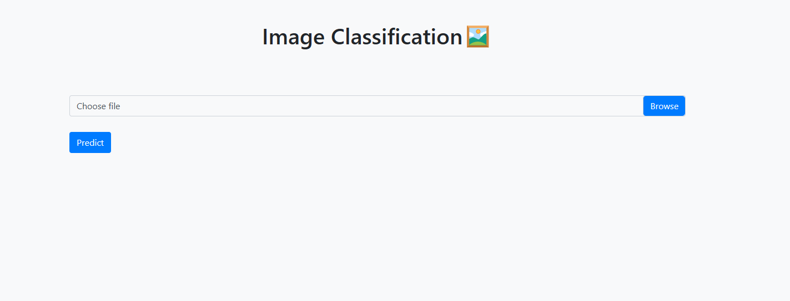
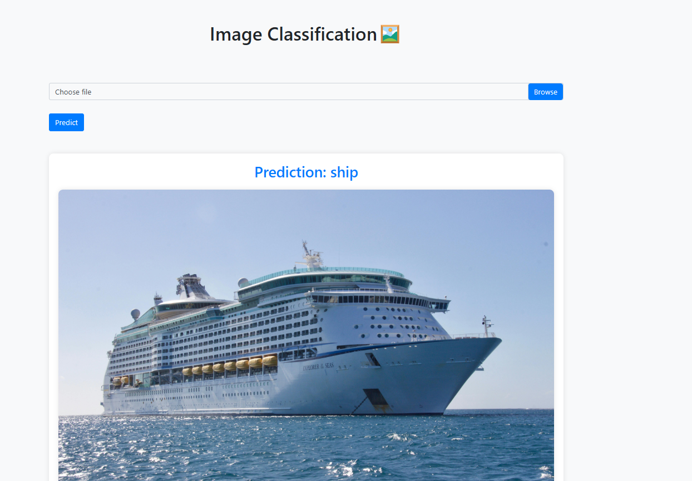

#  Image Classification Web App


A simple web application for image classification using a Convolutional Neural Network (CNN) implemented with TensorFlow and deployed with Flask.

## 🚀 Features

- Upload an image and get its predicted class label.
- CNN model trained on the CIFAR-10 dataset.
- Supports 10 different classes: airplane, automobile, bird, cat, deer, dog, frog, horse, ship, truck.
- Optimized training with data augmentation.

## 🛠️ Installation

1. Clone the repository:

    ```bash
    git clone https://github.com/your_username/image-classification-web-app.git
    ```

2. Navigate to the project directory:

    ```bash
    cd image-classification-web-app
    ```

3. Install the required packages:

    ```bash
    pip install -r requirements.txt
    ```

## ▶️ Usage

1. Run the Flask application:

    ```bash
    python app.py
    ```

2. Open your web browser and go to [http://localhost:5000](http://localhost:5000).
3. Upload an image and click on the "Predict" button.

## 🖼️ Screenshots




## 📝 License

This project is licensed under the [MIT License](LICENSE).
